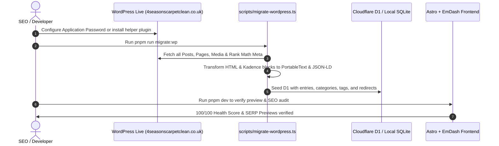

# WordPress to EmDash & Astro Migration Plan: `4seasonscarpetclean.co.uk`

## 1. Migration Overview

This document outlines the systematic, zero-downtime migration strategy for **4 Seasons Carpet Clean** (`https://4seasonscarpetclean.co.uk`) from its existing WordPress / Kadence setup into a blazing-fast, edge-rendered **Astro + EmDash CMS** architecture deployed on Cloudflare Workers.

---

## 2. Source Site Audit & Inventory

### 2.1 Domain & Hosting Specifications
* **URL:** `https://4seasonscarpetclean.co.uk`
* **Theme:** Kadence with Kadence Blocks
* **Current SEO Engine:** Rank Math SEO Pro (with Local SEO, FAQ blocks, and Redirections)
* **Performance Cache:** LiteSpeed Cache + Cloudflare CDN

### 2.2 Content Classification & URL Map
Based on live crawl and sitemap extraction:

#### Core Landing Pages
* `/` — Homepage (5.0★ Carpet Cleaning in London, hot water extraction, reviews, FAQs)
* `/carpet-cleaning-prices-london/` — Transparent pricing table for domestic & commercial
* `/expert-cleaning-services-london-gallery/` — Before/after job showcase
* `/faq/` — Comprehensive cleaning FAQs
* `/booking-carpet-cleaning-services-london/` — Online booking & quote request
* `/contact-us/` — Contact details, map, coverage areas, phone `+442034881970`
* `/terms-and-conditions/` — Legal terms and guarantee policies

#### Primary Service Pages
* `/carpet-cleaning-service-london/` — Residential Carpet Cleaning
* `/commercial-carpet-cleaning-london/` — Commercial & Office Carpet Cleaning
* `/rug-cleaning-near-me-london/` — Area & Oriental Rug Cleaning
* `/persian-rug-cleaning-london/` — Specialist Persian Rug Cleaning
* `/steam-cleaning-london/` — Steam Cleaning & Hot Water Extraction
* `/end-of-tenancy-cleaning-london/` — Move-out / Landlord Approved Cleaning
* `/stain-removal-london/` — Wine, pet, ink, and tough stain removal
* `/sofa-cleaning-london/` — Upholstery & Sofa Steam Cleaning
* `/mattress-cleaning-london/` — Deep Mattress Sanitation & Dust Mite Removal
* `/curtain-cleaning-london/` — In-situ Steam Curtain Cleaning
* `/emergency-carpet-cleaning-london/` — Same-day emergency response
* `/airbnb-cleaning-services-london/` — Short-let & Airbnb turnaround
* `/hard-floor-cleaning-services-london/` — Hard floor cleaning & sealing
* `/hardwood-floor-cleaning-polishing-london/` — Wood floor buffing & polishing

#### London Borough & Local Service Subpages
* `/carpet-cleaning-service-london/kensington/` — Kensington W8
* `/carpet-cleaning-service-london/knightsbridge/` — Knightsbridge SW1X
* `/carpet-cleaning-service-london/marylebone/` — Marylebone W1
* *(And surrounding London locations: Paddington, Chelsea, Battersea, Clapham, Wandsworth)*

#### Blog & Knowledge Base (`/blog/` & `/category/tips/`)
* 90+ published guides and tips (e.g., `/dry-carpet-faster-after-cleaning/`, `/steam-cleaning-vs-traditional-carpet-cleaning/`, `/cleaning-most-common-carpet-stains/`).

---

## 3. EmDash Collections Structure

In EmDash (`seed/seed.json` & D1 tables), the content is structured into three clean collections:

```typescript
// 1. Services Collection ('services')
{
  slug: "services",
  label: "Cleaning Services",
  urlPattern: "/{slug}",
  supports: ["drafts", "revisions", "preview", "search", "seo"],
  fields: [
    { slug: "title", label: "Service Name", type: "string", required: true },
    { slug: "short_description", label: "Short Description", type: "text" },
    { slug: "featured_image", label: "Featured Image", type: "image" },
    { slug: "price_starting_at", label: "Starting Price (£)", type: "number" },
    { slug: "content", label: "Service Details", type: "portableText" },
    { slug: "faqs", label: "Frequently Asked Questions", type: "json" },
    { slug: "benefits", label: "Key Benefits", type: "json" },
    { slug: "service_type", label: "Schema Service Type", type: "string" }
  ]
}

// 2. Posts Collection ('posts')
{
  slug: "posts",
  label: "Blog Articles",
  urlPattern: "/{slug}", // Preserves root WP permalink structure without /posts/ prefix!
  supports: ["drafts", "revisions", "preview", "scheduling", "search", "seo"],
  fields: [
    { slug: "title", label: "Title", type: "string", required: true },
    { slug: "featured_image", label: "Featured Image", type: "image" },
    { slug: "content", label: "Content", type: "portableText" },
    { slug: "excerpt", label: "Excerpt", type: "text" }
  ]
}

// 3. Pages Collection ('pages')
{
  slug: "pages",
  label: "Pages",
  urlPattern: "/{slug}",
  supports: ["drafts", "revisions", "preview", "search", "seo"],
  fields: [
    { slug: "title", label: "Page Title", type: "string", required: true },
    { slug: "content", label: "Content", type: "portableText" }
  ]
}
```

---

## 4. URL Preservation & Redirection Strategy

To protect 4 Seasons Carpet Clean's high Google search rankings in London:
1. **Zero URL Mutation:**
   * Every WordPress post, page, and service retains its exact slug and trailing slash behavior (handled via Astro middleware).
2. **Redirection Matrix:**
   * Rank Math redirections table `wp_rank_math_redirections` is extracted and loaded into Cloudflare D1.
   * Astro middleware evaluates incoming URLs at edge ($<1\text{ms}$) before route matching:
     * If matched, sends an instant `301 Moved Permanently`.
     * If 404, increments the hit counter in `seo_404_logs` for real-time monitoring.

---

## 5. Kadence Blocks to Astro Component Transformation

WordPress Kadence blocks are parsed and transformed during migration:

| WordPress / Kadence Element | Transformation in EmDash & Astro |
| :--- | :--- |
| `wp:kadence/rowlayout` | Responsive CSS Grid / Flexbox Astro container (`Container.astro`) |
| `div#rank-math-faq` | Native Accessible Astro Accordion component (`FaqAccordion.astro`) |
| `wp:image` | Astro `<Image />` component with automated WebP/AVIF format and responsive `srcset` |
| Kadence Info Box & Icons | Modern SVG feature badges with zero CSS overhead |
| Booking Forms | Modern Astro server endpoint `/api/booking` posting directly to email / CRM |

---

## 6. Migration Execution Steps


