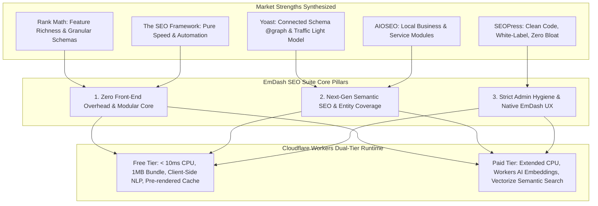
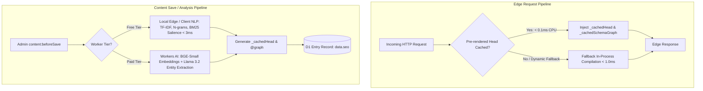

# Blueprint: Building the "Best of All" SEO Suite for EmDash CMS & Cloudflare Workers

> **Target Platform:** EmDash CMS & Astro on Cloudflare Workers (Free & Paid Tiers)  
> **Package:** `@emdash/plugin-seo`  
> **Status:** Architectural Strategy & Implementation Blueprint  
> **Core Objective:** Synthesize the strengths of top WordPress SEO plugins (Rank Math, Yoast, SEOPress, The SEO Framework, AIOSEO) while eliminating their universal flaws (admin bloat, database clutter, surface-level 2015 keyword density) to build the fastest, most intelligent, zero-overhead edge SEO suite.

---

## 1. Executive Summary & Competitive Synthesis

WordPress SEO plugins have dominated the web for nearly two decades, yet modern headless, edge-native platforms (like Astro + EmDash CMS on Cloudflare Workers) expose their deep architectural liabilities. By analyzing the market leaders, we extract their best innovations, reject their bloat, and engineer an edge-native successor.

### 1.1 Detailed Audit of Market Leaders vs. EmDash Target

| Plugin | Pros to Adopt | Cons to Eliminate | EmDash Suite Native Implementation |
| :--- | :--- | :--- | :--- |
| **Rank Math** | Granular JSON-LD schema builder, redirects, 404 monitoring, rich Gutenberg sidebar. | Admin bloat, upsell popups, proprietary DB tables (`wp_rank_math_redirections`), heavy REST calls. | Complete JSON-LD coverage; built-in redirects using native D1; **zero** custom tables unless strictly needed; **zero** upsell banners. |
| **Yoast SEO** | Rock-solid interconnected `@graph` schema, intuitive editorial traffic-light guidance. | Outdated UI paradigms, paywalls on multi-keywords/redirects, expensive per-site licenses. | Declarative connected `@graph` (`WebSite` $\rightarrow$ `Organization` $\rightarrow$ `WebPage` $\rightarrow$ `Article` $\rightarrow$ `Author`); traffic-light badges natively inside EmDash; 100% free and open-source. |
| **SEOPress** | Zero dashboard ads, white-label friendly, lightweight footprint, privacy-focused. | Basic content readability checks; requires manual SEO expertise. | Inherently white-label; zero telemetry; paired with intelligent semantic topic assistance. |
| **The SEO Framework (TSF)** | Fastest execution time, zero database bloat, automated metadata generation with smart fallbacks. | No built-in redirect manager, lacks keyword guidance for writers, sparse visual schema. | **Zero Front-End Overhead**: Pre-computed head tags on save; fallback cascade (`SEO Title` $\rightarrow$ `Entry Title` $\rightarrow$ `Site Name`); sub-0.1ms edge SSR runtime. |
| **All in One SEO (AIOSEO)** | Turnkey Local Business, Service, and OfferCatalog modules; beginner-friendly defaults. | High renewal pricing; aggressive and intrusive upsell dashboard notifications. | First-class `LocalBusiness`, `Service`, `OfferCatalog`, and `AggregateRating` schemas pre-configured with zero subscription barriers. |

---

## 2. The Three Architectural Pillars for EmDash CMS

To decisively outperform legacy WordPress plugins, `@emdash/plugin-seo` implements three architectural pillars tailored to EmDash CMS and Cloudflare Workers:

### Pillar 1: Architecture & Performance Core
1. **Zero Front-End Overhead (Pre-computed Edge Delivery):**
   * Legacy WordPress plugins execute database queries, regex content scans, and JSON serialization on *every single page request*.
   * In EmDash, the plugin computes the complete `<head>` metadata and connected JSON-LD `@graph` during `content:beforeSave` / `content:afterSave`, persisting pre-rendered strings into `data.seo._cachedHead` and `data.seo._cachedSchemaGraph`.
   * At edge pageview time, `<SeoHead />` performs a direct string interpolation. **Execution time drops from ~1.2ms to < 0.1ms**, with **0 D1 queries** and **0 regex operations**.
2. **Modular Loading & Strict Feature-Flags:**
   * Features are partitioned into independent modules: `sitemaps`, `robots`, `redirects`, `llmsTxt`, `contentAnalyzer`, `audit`, and `schemaMap`.
   * Unused modules are omitted at plugin configuration time; their routes and middleware are never mounted.
3. **Database Hygiene & Automatic Pruning:**
   * Core metadata resides in EmDash's native entry JSON payload (`data.seo`).
   * Supporting tables (`seo_link_graph`, `seo_404_logs`) utilize automated retention policies (e.g. 404 log capped at 1,000 entries, 30-day rolling window) with a clean `plugin:uninstall` handler that purges all traces.

### Pillar 2: Next-Gen Semantic SEO (Ditching 2015 Keyword Density)
1. **Entity & Topic Coverage over Exact Matches:**
   * Keyword density (e.g. 0.8% - 2.5%) is an obsolete 2015 heuristic ignored by modern neural search engines (Google RankBrain, BERT, MUM, Gemini).
   * The plugin replaces raw density checks with **Topical Entity Coverage**:
     * Computes TF-IDF and BM25 term salience for key domain concepts.
     * Identifies missing core entities and semantic co-occurrences (e.g. for "Carpet Cleaning", expects "hot water extraction", "stain removal", "drying time", "eco-friendly").
     * Delivers an **Entity Gap Score** to guide writers toward comprehensive subject-matter authority.
2. **Dynamic Contextual Internal Linking:**
   * Scans draft content against an in-memory / edge bi-directional link index.
   * Matches candidate target entries based on semantic relevance and suggests exact sentence contexts where natural anchor text can be placed.
3. **Declarative Connected JSON-LD Graph:**
   * Emits a unified `@graph` where all nodes reference each other via deterministic `@id` URIs (`#website`, `#organization`, `#place`, `#webpage`, `#article`, `#author`, `#service`).
   * Content blocks (Astro `<FaqBlock />`, `<TableOfContents />`) automatically contribute their structured data into the parent graph without duplicate or disconnected scripts.

### Pillar 3: UX & Admin Principles
1. **Strict Admin Hygiene:**
   * Zero admin notices, zero upselling banners, zero external telemetry calls.
   * 100% white-label and developer-first.
2. **Native EmDash Admin Integration:**
   * Deep integration with EmDash's React entry editor sidebar.
   * Real-time SERP and Social Card previews (Google Desktop/Mobile, X/Twitter, Facebook, LinkedIn).
   * Interactive topic coverage chips and one-click internal link insertion.
3. **Full CLI & REST API Coverage:**
   * Programmatic endpoints (`/_emdash/api/seo/v1/*`) and CLI commands (`emdash seo:audit`, `emdash seo:reindex`, `emdash seo:precompute`) for headless workflows, CI/CD verification, and migration scripts.

---

## 3. Cloudflare Workers Dual-Tier Strategy (Free vs. Paid)

Cloudflare Workers Free Tier enforces strict limits: **10 ms CPU time per request**, **1 MB compressed bundle size**, and **no dynamic worker loaders (`worker_loaders`)**. Paid plans unlock 30,000 ms CPU, Workers AI, Vectorize, and expanded KV limits.

The plugin provides a **dual-tier execution model**: 100% feature-complete and ultra-fast on the Free Tier, with progressive enhancement on Paid.

### Detailed Cloudflare Tier Comparison Matrix

| Capability | Cloudflare Free Tier Strategy | Cloudflare Paid Tier Progressive Enhancement |
| :--- | :--- | :--- |
| **Worker Architecture** | In-process native plugin (`format: "native"`). Zero `worker_loaders`. | Native or sandboxed with `worker_loaders`. |
| **CPU Budget** | Strict **$\le 10\text{ ms}$**. Target: $< 0.15\text{ ms}$ on SSR pageview. | $\le 30,000\text{ ms}$ CPU allowance. |
| **Bundle Size** | Minified $< 32\text{ KB}$ gzipped (well under the 1 MB worker cap). | Minified $< 32\text{ KB}$ gzipped. |
| **Front-End Rendering** | Direct string print of pre-computed `_cachedHead`. Zero edge computation. | Same zero front-end overhead for instant TTFB. |
| **Semantic SEO Engine** | Pure in-memory / browser-side lightweight TS: TF-IDF, N-gram extraction, BM25 entity coverage. | Hybrid: Local NLP + Cloudflare Workers AI (`@cf/baai/bge-small-en-v1.5` embeddings). |
| **Internal Linking** | In-memory token shingle matching & D1 indexed keyword graph. | Cloudflare Vectorize index for cosine similarity link recommendations. |
| **Sitemaps & Sitemaps Index** | Streaming chunked XML generation using Web `ReadableStream`. | Streaming XML + Workers KV edge caching with automated TTL. |
| **Audit Runner** | Incremental batch crawling (20 pages/batch via admin trigger). | Background batch processing using Cloudflare Queues or scheduled crons. |
| **IndexNow Notification** | Asynchronous HTTP dispatch via `fetch()` with timeout guard. | Queue-driven batched IndexNow dispatch. |

---

## 4. Implementation Blueprint & Architecture Mapping

To implement this vision, the `@emdash/plugin-seo` suite organizes its architectural evolution into the following technical specifications:

1. **[Semantic Content & Entity Engine (`docs/SEMANTIC_CONTENT_ENGINE.md`)](SEMANTIC_CONTENT_ENGINE.md)**  
   * Algorithmic design of TF-IDF, N-gram topic extraction, and BM25 entity salience.
   * Eliminating keyword density and calculating the **Entity Coverage Index (ECI)**.
   * Dynamic contextual internal link suggestion engine.
   * Workers AI embeddings bridge for Paid tier deployments.

2. **[Edge Performance, Pre-Computation & Storage Spec (`docs/EDGE_PERFORMANCE_AND_STORAGE_SPEC.md`)](EDGE_PERFORMANCE_AND_STORAGE_SPEC.md)**  
   * Pre-computed `<head>` and connected `@graph` caching in `data.seo._cachedHead`.
   * Sub-millisecond SSR head injection lifecycle.
   * Modular configuration and dynamic route mounting.
   * D1 schema definitions, retention policies, 404 auto-pruning, and clean uninstall script.
   * Free vs. Paid Cloudflare operational limits and benchmarks.

3. **[EmDash Admin UX, REST API & CLI Spec (`docs/EMDASH_ADMIN_AND_API_INTEGRATION.md`)](EMDASH_ADMIN_AND_API_INTEGRATION.md)**  
   * EmDash React Document Sidebar panel design and component architecture.
   * Real-time SERP and Social Card preview emulators.
   * Comprehensive REST API endpoints (`/_emdash/api/seo/v1/*`).
   * Headless CLI tooling (`emdash seo:audit`, `emdash seo:reindex`, `emdash seo:precompute`).
   * Strict Admin Hygiene: Zero ads, zero upsells, zero telemetry.

---

## 5. Architectural Verification & Quality Standards

Any proposed implementation must satisfy the following strict benchmarks:

* **Edge Latency:** SSR page head generation must complete in **$\le 0.2\text{ ms}$** CPU time.
* **Bundle Footprint:** Total compiled addition to the worker bundle must remain **$< 35\text{ KB}$** minified.
* **Test Coverage:** All algorithmic modules (TF-IDF, entity extraction, fuzzy redirects, schema builder) must maintain $> 95\%$ test coverage via Vitest.
* **Zero Disruption:** The architecture must preserve 100% backward compatibility with existing EmDash `supports: ["seo"]` collections and Astro `<EmDashHead />` integrations.
