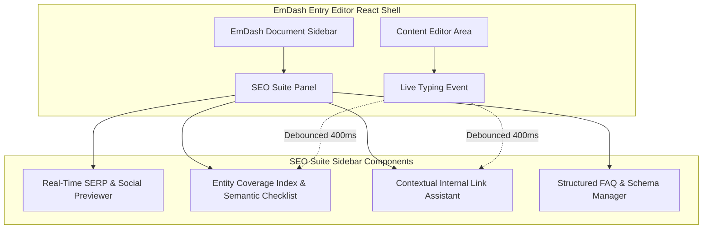

# EmDash Admin UX, REST API & CLI Integration Specification

> **Target:** Native EmDash Editor UI, Headless REST Endpoints, and Developer CLI  
> **Host Runtime:** EmDash CMS & Astro on Cloudflare Workers (Free & Paid Tiers)  
> **Status:** Technical Specification & UI/API Blueprint  

---

## 1. Strict Admin Hygiene & Ethical Design

A defining flaw of legacy WordPress SEO plugins (Rank Math, Yoast, AIOSEO) is aggressive **admin bloat**: persistent notification banners, upsell prompts, review nags, third-party analytics telemetry, and sluggish iframe-based metaboxes that degrade dashboard performance.

`@emdash/plugin-seo` operates on strict **Admin Hygiene Principles**:

1. **Zero Upselling & Advertisements:** 100% white-label. No "Pro" or "Premium" feature locks, no external upsell widgets, and zero marketing notices.
2. **Zero Telemetry Tracking:** No unsolicited analytics pings to external servers. All operations remain entirely within the user's Cloudflare Worker and D1 database.
3. **Sub-100ms Admin Interaction:** UI components are built natively with React, rendering directly into EmDash's Document Sidebar without heavy iframes or detached DOM roots.

---

## 2. Native EmDash Entry Editor React Integration

Instead of injecting massive, multi-tabbed boxes beneath the post editor, `@emdash/plugin-seo` extends EmDash's native entry editor through a responsive **Document Sidebar Extension**.



### 2.1 Real-Time SERP & Social Previewer
Provides instant visual emulation across four primary display targets:
* **Google Desktop SERP:** Title (with pixel-width cutoff at 600px), canonical breadcrumb URL, and meta description snippet.
* **Google Mobile SERP:** Favicon, site name header, truncated title, and rich snippet thumbnail.
* **Facebook / OpenGraph Card:** 1.91:1 aspect ratio preview (1200x630), domain badge, title, and description.
* **X (Twitter) Card:** `summary_large_image` emulator with handle attribution and image bounds.

### 2.2 Entity Coverage Index & Semantic Checklist
Replaces legacy keyword counting with interactive entity badges:
* **ECI Score Gauge:** Dynamic 0–100 circular score indicator with green/amber/red status.
* **Entity Coverage Badges:**
  * 🟢 **Green (Detected):** Entities found with sufficient salience (e.g., `hot water extraction`, `steam cleaning`).
  * 🟡 **Amber (Topic Gap):** Recommended domain entities missing from the draft. Clicking a badge suggests contextual placement.
* **Structural Hygiene Meters:**
  * Heading hierarchy check (Flags H1 $\rightarrow$ H3 skips).
  * Flesch-Kincaid Reading Ease gauge.
  * Image alt text completion counter.

### 2.3 Contextual Internal Link Assistant
* Automatically scans draft paragraphs against the published collection link index.
* Displays card suggestions with matched entities and surrounding sentence context.
* Features a single **"Insert Link"** button that wraps the anchor text in the active editor state without manual copy-pasting.

---

## 3. Comprehensive REST API Specification (`/_emdash/api/seo/v1/*`)

To support programmatic publishing, automated migrations, and headless frontends, the plugin exposes a fully typed, authenticated REST API.

### 3.1 Endpoint Reference

| Method | Endpoint | Description | Auth Required |
| :--- | :--- | :--- | :--- |
| `GET` | `/_emdash/api/seo/v1/meta/:collection/:id` | Retrieve an entry's SEO metadata, pre-computed head, and schema graph. | Yes (Read) |
| `PUT` | `/_emdash/api/seo/v1/meta/:collection/:id` | Update SEO metadata and trigger head re-computation. | Yes (Write) |
| `POST` | `/_emdash/api/seo/v1/analyze` | Stateless content analyzer: accepts HTML/text and returns full semantic audit. | Yes (Read) |
| `GET` | `/_emdash/api/seo/v1/links/opportunities/:id` | Fetch contextual internal link recommendations for an entry. | Yes (Read) |
| `POST` | `/_emdash/api/seo/v1/audit/run` | Trigger a sitewide technical crawl and audit. | Yes (Admin) |
| `GET` | `/_emdash/api/seo/v1/audit/latest` | Retrieve latest audit results, health score, and issue inventory. | Yes (Read) |
| `GET` | `/_emdash/api/seo/v1/redirects` | List all configured edge redirects with pagination. | Yes (Admin) |
| `POST` | `/_emdash/api/seo/v1/redirects` | Create or batch-import redirect rules. | Yes (Admin) |
| `GET` | `/_emdash/api/seo/v1/404s` | Retrieve top missed URLs with hit counts and referrers. | Yes (Admin) |

### 3.2 Stateless Content Analysis Request & Response

#### Request: `POST /_emdash/api/seo/v1/analyze`
```json
{
  "title": "Professional Carpet Cleaning in London | Eco-Friendly Care",
  "slug": "carpet-cleaning-london",
  "contentHtml": "<h2>Expert Carpet Cleaning</h2><p>Our hot water extraction process removes deep stains and pet odors efficiently...</p>",
  "focusKeywords": ["carpet cleaning london"],
  "metaDescription": "Book professional carpet cleaning in London. Eco-friendly steam cleaning with quick drying times."
}
```

#### Response: `200 OK`
```json
{
  "entityCoverageIndex": 84,
  "grade": "Good",
  "entitiesDetected": [
    { "name": "hot water extraction", "salienceScore": 0.92, "inHeadings": false },
    { "name": "steam cleaning", "salienceScore": 0.88, "inHeadings": false },
    { "name": "pet odors", "salienceScore": 0.74, "inHeadings": false }
  ],
  "entityGaps": [
    {
      "entity": "drying time",
      "recommendedCategory": "service details",
      "importance": "recommended"
    },
    {
      "entity": "upholstery cleaning",
      "recommendedCategory": "related services",
      "importance": "optional"
    }
  ],
  "readability": {
    "fleschReadingEase": 68.4,
    "grade": "Standard (Plain English)",
    "hardSentencesCount": 1
  },
  "technicalChecks": {
    "h1Valid": true,
    "imagesWithAlt": true,
    "metaDescriptionLength": 104
  }
}
```

---

## 4. Developer CLI Tooling (`emdash seo:*`)

To integrate with automated CI/CD deployment pipelines, headless static builds, and automated maintenance, `@emdash/plugin-seo` provides CLI commands.

### 4.1 CLI Command Reference

```bash
# 1. Sitewide Technical SEO Audit
# Evaluates all published entries against technical SEO criteria.
# Exits with status code 1 if critical issues exceed threshold (ideal for CI/CD gates).
pnpm run emdash seo:audit --fail-on-critical

# 2. Warm & Pre-Compute Head Cache
# Iterates through all published entries in Cloudflare D1 and populates
# _cachedHead and _cachedSchemaGraph for sub-0.1ms edge SSR delivery.
pnpm run emdash seo:precompute --collection=posts,pages,services

# 3. Rebuild Internal Link Graph
# Re-analyzes all content links, populates the seo_link_graph table,
# and outputs an inventory of detected orphan pages.
pnpm run emdash seo:reindex-links

# 4. Database Hygiene & Pruning
# Prunes 404 records older than 30 days and removes obsolete audit snapshots.
pnpm run emdash seo:prune --days=30
```

### 4.2 CI/CD Deployment Gate Example
In GitHub Actions or Cloudflare Pages build configurations:

```yaml
name: Deploy Verification
on: [push]
jobs:
  seo-quality-check:
    runs-on: ubuntu-latest
    steps:
      - uses: actions/checkout@v4
      - uses: pnpm/action-setup@v3
      - name: Run SEO CI Quality Gate
        run: |
          pnpm install
          pnpm run emdash seo:audit --threshold=80
```
