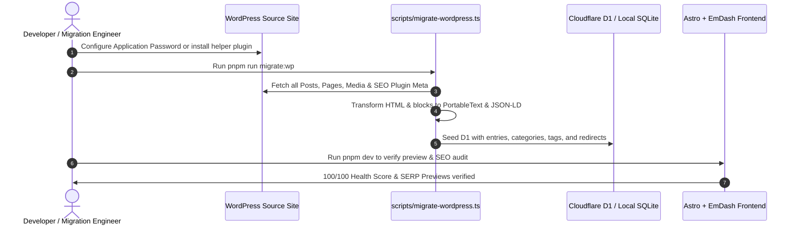

# WordPress to EmDash & Astro Migration Plan

## 1. Migration Overview

This document outlines the systematic, zero-downtime migration strategy for transitioning any content-rich **WordPress** website into a blazing-fast, edge-rendered **Astro + EmDash CMS** architecture deployed on Cloudflare Workers, powered by the **EmDash SEO Suite** (`@emdash/plugin-seo`).

---

## 2. Source Site Audit & Inventory Strategy

### 2.1 Stack Assessment
* **CMS:** WordPress (v5.6+)
* **Themes & Page Builders:** Block themes, classic themes, Kadence, Elementor, or Gutenberg
* **SEO Plugins:** Rank Math SEO (Free/Pro), Yoast SEO (Free/Premium), All in One SEO, or SEOPress
* **Target Runtime:** Cloudflare Workers (Free & Paid tiers), D1 Database, R2 Object Storage

### 2.2 Content Classification & URL Map
A thorough migration classifies the existing site inventory into structured EmDash collections:

#### Core Landing Pages
* `/` — Homepage (hero, value propositions, social proof, reviews, FAQs)
* `/pricing/` — Transparent pricing tables and packages
* `/gallery/` / `/portfolio/` — Case studies and portfolio showcase
* `/faq/` — Comprehensive question and answer repository
* `/contact-us/` — Contact information, location maps, inquiry forms
* `/terms/` & `/privacy-policy/` — Legal terms and policies

#### Primary Service / Product Pages
* `/{service-slug}/` — Dedicated landing pages with schema-rich structured data (`LocalBusiness`, `Service`, `OfferCatalog`).

#### Category & Taxonomy Subpages
* `/{service-slug}/{sub-region}/` or `/{parent-category}/{child-category}/` — Hierarchical landing pages with automated breadcrumbs.

#### Articles & Guides (`/blog/` or `/{slug}/`)
* Editorial content and tutorials preserved with original permalink structures and author attributions.

---

## 3. EmDash Collections Structure

In EmDash (`seed/seed.json` & D1 tables), content is structured into three clean, extensible collections:

```typescript
// 1. Services Collection ('services')
{
  slug: "services",
  label: "Services",
  urlPattern: "/{slug}",
  supports: ["drafts", "revisions", "preview", "search", "seo"],
  fields: [
    { slug: "title", label: "Service Name", type: "string", required: true },
    { slug: "short_description", label: "Short Description", type: "text" },
    { slug: "featured_image", label: "Featured Image", type: "image" },
    { slug: "price_starting_at", label: "Starting Price", type: "number" },
    { slug: "content", label: "Service Details", type: "portableText" },
    { slug: "faqs", label: "Frequently Asked Questions", type: "json" },
    { slug: "benefits", label: "Key Benefits", type: "json" },
    { slug: "service_type", label: "Schema Service Type", type: "string" }
  ]
}

// 2. Posts Collection ('posts')
{
  slug: "posts",
  label: "Blog Articles",
  urlPattern: "/{slug}", // Preserves root permalinks without forced subfolders
  supports: ["drafts", "revisions", "preview", "scheduling", "search", "seo"],
  fields: [
    { slug: "title", label: "Title", type: "string", required: true },
    { slug: "featured_image", label: "Featured Image", type: "image" },
    { slug: "content", label: "Content", type: "portableText" },
    { slug: "excerpt", label: "Excerpt", type: "text" }
  ]
}

// 3. Pages Collection ('pages')
{
  slug: "pages",
  label: "Pages",
  urlPattern: "/{slug}",
  supports: ["drafts", "revisions", "preview", "search", "seo"],
  fields: [
    { slug: "title", label: "Page Title", type: "string", required: true },
    { slug: "content", label: "Content", type: "portableText" }
  ]
}
```

---

## 4. URL Preservation & Redirection Strategy

To protect existing search engine rankings and domain equity:
1. **Zero URL Mutation:**
   * Every WordPress post, page, and service retains its exact slug and trailing slash behavior (handled via Astro middleware).
2. **Edge Redirection Matrix:**
   * WordPress redirect tables (such as `wp_rank_math_redirections`) are extracted and loaded into Cloudflare D1.
   * Astro middleware evaluates incoming URLs at the edge ($<1\text{ms}$) before route matching:
     * If matched, sends an instant `301 Moved Permanently`.
     * If 404, increments the hit counter in `seo_404_logs` for real-time monitoring and 404 recovery.

---

## 5. WordPress Blocks to Astro Component Transformation

WordPress block elements are parsed and transformed during migration:

| WordPress / Block Element | Transformation in EmDash & Astro |
| :--- | :--- |
| `wp:kadence/rowlayout` / Gutenberg columns | Responsive CSS Grid / Flexbox Astro container (`Container.astro`) |
| `div#rank-math-faq` / Yoast FAQ blocks | Native Accessible Astro Accordion component (`FaqAccordion.astro` / `FaqBlock.astro`) |
| `wp:image` | Astro `<Image />` component with automated WebP/AVIF format and responsive `srcset` |
| Info Box & Icons | Modern SVG feature badges with zero runtime CSS overhead |
| Form Plugins | Modern Astro server endpoint `/api/contact` posting directly to email / CRM |

---

## 6. Migration Execution Steps


