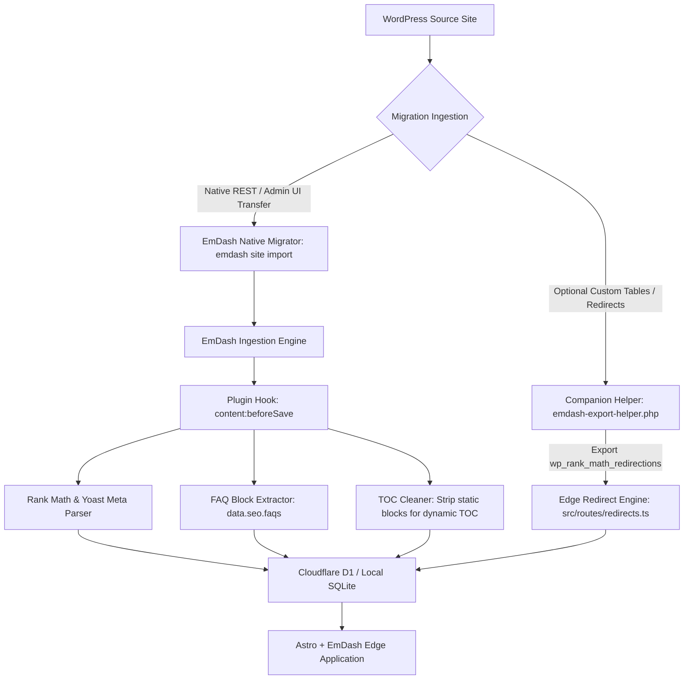

# Product Requirement Document (PRD): EmDash SEO Suite (`@emdash/plugin-seo`) & WordPress Migration Architecture

## 1. Executive Summary & Architecture Overview

The **EmDash SEO Suite** is an enterprise-grade, zero-runtime-dependency SEO plugin designed specifically for EmDash CMS and Astro, coupled with an automated migration pipeline to transition WordPress sites (Rank Math Pro, Yoast SEO Premium, All in One SEO) into modern, edge-rendered Astro + EmDash architectures.

Built as an **in-process Native Plugin**, it bypasses the requirement for Cloudflare Dynamic Worker loaders (`worker_loaders`), guaranteeing complete feature parity across:

* **Local Development:** Node.js (v22+) + SQLite.
* **Cloudflare Workers Free Tier:** Execution within the primary worker bundle under strict **10 ms CPU constraints**, **1 MB compressed bundle size**, and zero subscription costs.
* **Cloudflare Workers Paid / Self-hosted (Dokploy / Coolify):** Unconstrained edge execution with extended CPU and memory allowances.

The suite combines:
1. **Core SEO Capabilities:** Matching and exceeding the top WordPress SEO plugins (**Rank Math Pro**, **Yoast SEO Premium**, **All in One SEO**, and **SEOPress**).
2. **Automated WP Migration Engine:** Direct extraction of WordPress content, custom fields, Gutenberg / page builder blocks, and SEO metadata (focus keywords, canonicals, robots flags, social cards, redirects, and connected schema graphs).
3. **Local Business & Service SEO:** Specialized structured data engine for business entities, services, pricing, customer reviews, and FAQ accordion schema.

---

## 2. Target Site Migration Architecture

### 2.1 Archetypal Source Site Profile
* **CMS:** WordPress (v5.6+)
* **Themes & Page Builders:** Gutenberg, Kadence, Elementor, or Classic Block Editors
* **Current SEO Plugins:** Rank Math SEO (Free/Pro), Yoast SEO (Free/Premium), All in One SEO, or SEOPress
* **Typical Entities:** Local business profiles, multi-location services, editorial blog posts, and customer review schemas
* **Stack Target:** Astro + EmDash CMS on Cloudflare Workers edge runtime

### 2.2 Critical Migration Objectives
1. **Zero Organic Search Loss:** Preserve 100% of existing URL slugs (`/{slug}/`) with consistent trailing slash handling.
2. **Comprehensive Redirection Engine:** Port all existing redirects from Rank Math (`wp_rank_math_redirections`) or Yoast to Cloudflare D1 with instant edge execution.
3. **SEO Plugin Data Ingestion:** Extract all post meta (`title`, `description`, `focus_keyword`, `robots`, `canonical_url`, schemas, OpenGraph, Twitter).
4. **FAQ Block Parsing:** Extract FAQ blocks (`div#rank-math-faq`) and convert them into native Astro interactive accordions + JSON-LD `FAQPage` schemas.
5. **Connected Schema Graph:** Reconstruct the complete connected `@graph` with `LocalBusiness`, `Organization`, `WebSite`, `WebPage`, `AggregateRating`, `OfferCatalog`, and `BreadcrumbList`.

---

## 3. Core Functional Specifications (Best-of-WordPress SEO Parity)

### 3.1 Metadata, Social Cards & SERP Inspector
* **Dynamic Variable Templating:** Tokens supported across all collections:
  * `%title%` — Current entry title
  * `%separator%` — Site separator (e.g. `|`, `—`)
  * `%siteName%` — Global site name
  * `%excerpt%` — Post excerpt or auto-generated summary
  * `%date%` / `%modified%` — Publication / update dates
  * `%category%` / `%primaryCategory%` — Primary taxonomy term
  * `%customField:key%` — Any custom field value
* **Robots Meta Directives:** Granular per-entry and sitewide defaults:
  * `noindex`, `nofollow`, `noarchive`, `nosnippet`, `max-snippet:-1`, `max-image-preview:large`, `max-video-preview:-1`
* **Canonical Overrides:** Canonical URL self-referencing by default, with custom cross-domain or URL parameter overrides.
* **Social Graph (OpenGraph & Twitter):**
  * Auto-fallback cascade: Custom Social Image $\rightarrow$ Featured Image $\rightarrow$ Global Default Social Image.
  * Image dimension tags (`og:image:width`, `og:image:height`), `og:locale: en_GB`, `twitter:card: summary_large_image`.
* **SERP & Social Preview UI:** Real-time visual emulation in the EmDash React admin panel for Google Desktop, Google Mobile, Facebook Feed, and X (Twitter) Card.

### 3.2 Advanced Schema Graph Engine (JSON-LD `@graph`)
* **Unified Connected Graph:** Output a single `<script type="application/ld+json">` with linked `@id` references (`#website`, `#organization`, `#place`, `#webpage`, `#service`, `#breadcrumb`).
* **Entity Types Supported:**
  * **LocalBusiness & Organization:** Address, telephone, GeoCoordinates, GeoCircle area definitions, opening hours, price range (`££`), sameAs social profiles.
  * **AggregateRating & Reviews:** `ratingValue: 5.0`, `reviewCount: 150+`, ratings source attribution.
  * **Service & OfferCatalog:** Structured catalog of services with price currency and availability.
  * **FAQPage:** Extraction of Q&A pairs from content blocks and dedicated FAQ collections.
  * **Article / BlogPosting / NewsArticle:** Author person reference, publisher organization, datePublished, dateModified.
  * **BreadcrumbList:** Hierarchical trail based on collection URL pattern and primary taxonomy.

### 3.3 Real-time On-Page Content & Readability Analyzer
* **Keyword Checks:**
  * Focus keyword in SEO Title (preferably near the front)
  * Focus keyword in Meta Description
  * Focus keyword in URL Slug
  * Focus keyword in First 100 Words of content
  * Focus keyword in at least one H2/H3 subheading
  * Focus keyword density calculation (0.8% - 2.5% target zone)
* **Technical On-Page Quality:**
  * Single H1 presence validation & heading hierarchy (no skipped levels, e.g. H2 $\rightarrow$ H4)
  * Content length benchmark (e.g. 600+ words for blog posts, 800+ for cornerstone service pages)
  * Image audit: missing `alt` attributes, image dimensions, WebP/AVIF format suggestions
  * External link count & internal link count detection
* **Scoring:** Dynamic 0–100 health score with categorized badges: `Passed` (Green), `Warning` (Yellow), `Critical` (Red).

### 3.4 Internal Linking Graph Engine & Orphan Page Detector
* **Link Index Table:** In-memory / D1 edge database tracking all inbound and outbound links across published content.
* **Relevance Matching:** Scan drafts against target titles and focus keywords to suggest relevant internal link anchors.
* **Orphan Page Detection:** Instant query identifying any published URL with 0 inbound internal links.

### 3.5 Crawlability, Sitemaps & Next-Gen Protocols
* **Dynamic XML Sitemap (`/sitemap.xml`):**
  * Auto-sharded index (`/sitemap-index.xml`) when exceeding 1,000 URLs.
  * Sub-sitemaps: `/post-sitemap.xml`, `/page-sitemap.xml`, `/service-sitemap.xml`, `/category-sitemap.xml`.
  * Image sitemap tags (`<image:image><image:loc>...</image:loc></image:image>`).
  * Automated exclusion of `noindex` items, drafts, and admin routes.
* **Edge Virtual `robots.txt` (`/robots.txt`):** Dynamic disallow rules, custom user-agent blocks, and auto-injected `Sitemap:` URLs.
* **AI Search Optimization (`/llms.txt` & `/llms-full.txt`):** Edge-rendered Markdown sitemaps optimized for LLM crawlers (Perplexity, ChatGPT, Claude, Gemini).

### 3.7 Automated Breadcrumbs & BreadcrumbList Schema
* **URL-Driven Hierarchy:** Automatically computes breadcrumb trails from any URL path (e.g., `Home` $\rightarrow$ `Carpet Cleaning Service London` $\rightarrow$ `Kensington`).
* **Taxonomy & Category Integration:** Seamlessly inserts primary categories for single-segment blog post permalinks.
* **Dual Output:**
  * **Visual Component (`Breadcrumbs.astro`):** Accessible `<nav aria-label="Breadcrumb">` markup with microdata (`itemscope itemtype="https://schema.org/BreadcrumbList"`).
  * **Structured Data:** Injects `BreadcrumbList` node into the unified `@graph` JSON-LD payload.

### 3.8 Automated Table of Contents (TOC) & ItemList Schema
* **Heading Analysis:** Automatically inspects content for `<h2>` and `<h3>` elements.
* **Anchor Generation:** Injects deterministic slugified `id` attributes into headings if not already present.
* **Visual Component (`TableOfContents.astro`):** Clean, sticky or inline hierarchical navigation with smooth scrolling and jump links.
* **Schema.org Jump Link Markup:** Emits `ItemList` schema linked via `hasPart` in `WebPage`, enabling Google Search to display rich sitelink jump anchors in search results.

### 3.9 Automated FAQ Block & FAQPage Schema
* **Multi-Source Extraction:**
  * Auto-detects Rank Math FAQ blocks (`div#rank-math-faq`) and extracts questions/answers into structured data.
  * Ingests dedicated `data.seo.faqs` collection arrays.
  * Auto-extracts question patterns from content headings followed by paragraphs.
* **Visual Component (`FaqBlock.astro` / `FaqAccordion.astro`):** Interactive accessible HTML `<details>/<summary>` accordion.
* **Google FAQPage Schema:** Emits `@type: FAQPage` with nested `Question` and `Answer` nodes linked directly to the parent `WebPage`.

---

## 4. WordPress & SEO Plugins Data Migration Architecture

### 4.1 Supported SEO Plugin Ingestion
The migration engine supports importing metadata from:
1. **Rank Math SEO Pro:**
   * Meta title: `rank_math_title`
   * Meta description: `rank_math_description`
   * Focus keyword: `rank_math_focus_keyword`
   * Robots flags: `rank_math_robots` (serialized array: `index`/`noindex`, `follow`/`nofollow`, `noarchive`, `nosnippet`, etc.)
   * Canonical URL: `rank_math_canonical_url`
   * Facebook / OG: `rank_math_facebook_title`, `rank_math_facebook_description`, `rank_math_facebook_image`
   * Twitter / X: `rank_math_twitter_title`, `rank_math_twitter_description`, `rank_math_twitter_image`
   * Schema: `rank_math_schema_*` and rich snippets data
   * Redirections: `wp_rank_math_redirections` database table
2. **Yoast SEO Premium:**
   * Meta title: `_yoast_wpseo_title`
   * Meta description: `_yoast_wpseo_metadesc`
   * Focus keyword: `_yoast_wpseo_focuskw`
   * Robots flags: `_yoast_wpseo_meta-robots-noindex`, `_yoast_wpseo_meta-robots-nofollow`
   * Canonical URL: `_yoast_wpseo_canonical`
   * Social: `_yoast_wpseo_opengraph-title`, `_yoast_wpseo_opengraph-image`, `_yoast_wpseo_twitter-title`
3. **All in One SEO (AIOSEO) & SEOPress:**
   * Auto-mapping from `_aioseo_*` and `_seopress_*` equivalents.

### 4.2 Native Migration Pipeline & Plugin Interception



#### Dual Connection Architecture:
1. **EmDash Native Migrator (`emdash site import` or Admin UI Transfer):**
   * Uses EmDash's official migration engine to ingest posts, pages, categories, tags, and media directly via the standard WordPress REST API.
   * As each entry is processed, `@emdash/plugin-seo`'s `content:beforeSave` lifecycle hook intercepts the entry, extracts SEO metadata from `meta._rankmath` and `meta._yoast`, parses FAQ blocks into structured `data.seo.faqs`, and cleans static TOC blocks so dynamic sitelink jump schemas can be generated.
2. **Companion Helper WordPress Export Plugin (`scripts/emdash-export-helper.php`):**
   * Lightweight companion plugin for the WordPress source site.
   * Exposes authenticated endpoint `/wp-json/emdash-export/v1/redirections` to export custom database tables (`wp_rank_math_redirections` or `redirection_items`) that standard WP REST API endpoints omit.
   * Completely standalone and does not modify upstream plugins (e.g. `wp-emdash`), preserving modularity.

### 4.3 EmDash Native Migrator: Lifecycle Interception Strategy
* **Native Ingestion Foundation:** Rather than maintaining duplicate standalone migration scripts, the architecture leverages EmDash's official migrator (`emdash site import` CLI command or the Admin UI Site Transfer tool).
* **The Gap in Core EmDash:** Core EmDash preserves `post.rankmath` and `post.yoast` only as raw unparsed objects in `meta._rankmath` and `meta._yoast`. It does not parse focus keywords, robots directives, canonicals, rich schemas (`CleaningService`, `LocalBusiness`, `FAQPage`), FAQ blocks, or TOC jump links.
* **Seamless Extension via Lifecycle Hooks:** `@emdash/plugin-seo` bridges this gap natively:
  1. **Lifecycle Interception:** The plugin registers a `content:beforeSave` hook in `src/index.ts`. Any entry imported with `meta._rankmath` or `meta._yoast` is automatically parsed and elevated into first-class `data.seo` attributes.
  2. **FAQ Block Extraction:** Automatically identifies Rank Math FAQ blocks (`<!-- wp:rank-math/faq-block -->` or `div#rank-math-faq`) in Gutenberg content, extracts questions and answers into `data.seo.faqs`, and outputs Google-compliant `FAQPage` schema.
  3. **Table of Contents Modernization:** Detects static Rank Math TOC blocks (`<!-- wp:rank-math/toc-block -->` or `#rank-math-toc`) and strips them from post content so the dynamic `<TableOfContents />` component can render responsive navigation with Google `ItemList` jump link schema.
  4. **Custom Table Ingestion:** The companion helper plugin (`scripts/emdash-export-helper.php`) provides an export for `wp_rank_math_redirections` for Cloudflare D1 edge redirect tables.

---

## 5. Database Schema Design (Cloudflare D1 / SQLite)

The plugin introduces three dedicated tables and uses the EmDash native redirects table:

```sql
-- Migration: 0020_seo_suite.sql

-- 1. Internal Link Graph
CREATE TABLE IF NOT EXISTS seo_link_graph (
    id TEXT PRIMARY KEY,
    source_collection TEXT NOT NULL,
    source_id TEXT NOT NULL,
    target_url TEXT NOT NULL,
    target_collection TEXT,
    target_id TEXT,
    anchor_text TEXT,
    is_external INTEGER NOT NULL DEFAULT 0,
    created_at TEXT NOT NULL DEFAULT (datetime('now')),
    FOREIGN KEY (source_id) REFERENCES entries(id) ON DELETE CASCADE
);

CREATE INDEX IF NOT EXISTS idx_link_graph_target ON seo_link_graph(target_collection, target_id);
CREATE INDEX IF NOT EXISTS idx_link_graph_source ON seo_link_graph(source_collection, source_id);

-- 2. Sitewide Technical SEO Audits
CREATE TABLE IF NOT EXISTS seo_audit_runs (
    id TEXT PRIMARY KEY,
    status TEXT NOT NULL CHECK (status IN ('running', 'completed', 'failed')),
    health_score INTEGER NOT NULL DEFAULT 0,
    total_pages INTEGER NOT NULL DEFAULT 0,
    issues_critical INTEGER NOT NULL DEFAULT 0,
    issues_warning INTEGER NOT NULL DEFAULT 0,
    issues_notice INTEGER NOT NULL DEFAULT 0,
    report_json TEXT, -- Aggregated JSON array of all issues
    started_at TEXT NOT NULL DEFAULT (datetime('now')),
    completed_at TEXT
);

-- 3. Global SEO & Protocol Configuration
CREATE TABLE IF NOT EXISTS seo_settings (
    key TEXT PRIMARY KEY,
    value TEXT NOT NULL,
    updated_at TEXT NOT NULL DEFAULT (datetime('now'))
);

-- 4. 404 Error Log
CREATE TABLE IF NOT EXISTS seo_404_logs (
    id TEXT PRIMARY KEY,
    url TEXT NOT NULL,
    referer TEXT,
    user_agent TEXT,
    hits INTEGER NOT NULL DEFAULT 1,
    last_hit_at TEXT NOT NULL DEFAULT (datetime('now'))
);
CREATE INDEX IF NOT EXISTS idx_seo_404_url ON seo_404_logs(url);
```

### 5.1 Content Entry Metadata Schema (`data.seo`)
Metadata is stored within the collection entry's JSON payload, fully compatible with EmDash's `supports: ["seo"]` contract:

```typescript
export interface EntrySeoMetadata {
  metaTitle?: string;
  metaDescription?: string;
  canonicalUrl?: string;
  focusKeywords: string[];
  noIndex: boolean;
  noFollow: boolean;
  noArchive?: boolean;
  noSnippet?: boolean;
  maxImagePreview?: 'none' | 'standard' | 'large';
  ogTitle?: string;
  ogDescription?: string;
  ogImage?: string;
  ogType?: 'website' | 'article' | 'service';
  twitterCard?: 'summary' | 'summary_large_image';
  schemaType?: 'CleaningService' | 'LocalBusiness' | 'Service' | 'Article' | 'FAQPage' | 'None';
  schemaOverrides?: Record<string, any>;
  faqs?: Array<{ question: string; answer: string }>;
  primaryCategory?: string;
}
```

---

## 6. Cloudflare Workers Free vs. Paid Performance Profile

| Operational Metric | Cloudflare Free Tier | Cloudflare Paid Tier | EmDash SEO Suite Strategy |
| :--- | :--- | :--- | :--- |
| **CPU Time per Request** | **10 ms** strict limit | 30,000 ms limit | All sitemaps, robots.txt, and JSON-LD schemas use streaming string buffers with zero heavy AST traversals at edge request time. Heavy audits run incrementally via batches. |
| **Worker Bundle Size** | **1 MB compressed** | 10 MB compressed | Zero external npm dependencies. Uses native Web APIs (`fetch`, `URL`, `crypto`, `ReadableStream`) and lightweight compiled TypeScript. |
| **Dynamic Plugin Loaders** | **Not Available** (`worker_loaders` disabled) | Available (`worker_loaders` enabled) | Built as an **in-process Native Plugin** mounted directly into Astro / EmDash configuration (`emdash({ plugins: [seoPlugin()] })`). Runs seamlessly on Free Tier without loader dependencies. |
| **Database** | Cloudflare D1 (5M reads/day free) | Cloudflare D1 (standard) | D1 edge queries with prepared statements and in-memory request-caching. |
| **Media / Assets** | Cloudflare R2 (10 GB free) or CDN | Cloudflare R2 | WordPress images mapped to R2 or served via high-speed edge image proxy. |

---

## 7. Package File Layout (`packages/emdash-seo`)

```text
packages/emdash-seo/
├── package.json
├── tsconfig.json
├── src/
│   ├── index.ts                      # Plugin entrypoint (definePlugin declaration)
│   ├── types.ts                      # TypeScript interfaces (SEO, schema, analyzer, link graph)
│   ├── config.ts                     # Default configuration & variable resolver
│   ├── head/
│   │   ├── SeoHead.astro             # Complete drop-in Astro head component
│   │   ├── OpenGraph.astro           # Social meta tags builder
│   │   └── SchemaGraph.astro         # Connected JSON-LD @graph generator
│   ├── engine/
│   │   ├── content-analyzer.ts       # Focus keyword density, placement & readability
│   │   ├── link-analyzer.ts          # Link extraction, bi-directional index & orphan detection
│   │   ├── schema-builder.ts         # LocalBusiness, CleaningService, Service & FAQ graph builder
│   │   └── audit-runner.ts           # Sitewide edge crawling and health scoring
│   ├── routes/
│   │   ├── sitemap.ts                # Edge XML sitemaps & sitemap index generator
│   │   ├── robots.ts                 # Dynamic robots.txt handler
│   │   ├── llms-txt.ts               # AI search /llms.txt and /llms-full.txt generator
│   │   ├── redirects.ts              # Edge 301/302/410 redirect handler and 404 logger
│   │   └── api-audit.ts              # Admin API for triggering audits and viewing reports
│   ├── hooks/
│   │   ├── before-save.ts            # Variable resolution, auto-excerpt, link extraction
│   │   └── after-publish.ts          # Link graph synchronization & sitemap cache invalidation
│   ├── importers/
│   │   ├── rankmath-importer.ts      # Rank Math metadata & redirection parser
│   │   ├── yoast-importer.ts         # Yoast SEO metadata parser
│   │   └── wp-wxr-importer.ts        # WordPress WXR XML & REST API post/page importer
│   └── ui/
│       ├── SeoEditorTab.tsx          # EmDash admin React tab (SERP preview, keywords, schema)
│       ├── SeoAuditDashboard.tsx     # Sitewide technical audit dashboard
│       └── components/
│           ├── SerpPreview.tsx       # Desktop & Mobile Google SERP emulator
│           ├── SocialPreview.tsx     # Facebook & X (Twitter) card emulator
│           ├── KeywordChecklist.tsx  # Interactive on-page SEO score checklist
│           └── FaqEditor.tsx         # Structured FAQ editor with instant preview
```

---

## 8. Implementation Milestones

1. **Step 1: Workspace Initialization & Environment Setup:**
   * Initialize Astro + EmDash project with Cloudflare worker adapter (`@astrojs/cloudflare`, `@emdash-cms/cloudflare`).
   * Create `packages/emdash-seo` skeleton with zero runtime dependencies.
   * Provide `.env.example` with WordPress authentication variables (`WP_URL`, `WP_USER`, `WP_APP_PASSWORD`).
2. **Step 2: SEO Plugin Core Engine (`packages/emdash-seo`):**
   * Implement types, variable resolvers (`%title%`, `%siteName%`, `%separator%`).
   * Build `content-analyzer.ts` (keyword density, placement, word count, heading hierarchy).
   * Build `schema-builder.ts` with complete `LocalBusiness` / `Organization` / `Service` / `FAQPage` connected `@graph`.
   * Build `SeoHead.astro` for instant drop-in to Astro layouts.
3. **Step 3: Protocol & Edge Routes:**
   * Dynamic `/sitemap.xml` and `/sitemap-index.xml` with image extensions.
   * Dynamic `/robots.txt` and AI search `/llms.txt` & `/llms-full.txt`.
   * Edge redirect processor and 404 logging route.
4. **Step 4: WordPress Migration Pipeline:**
   * Native EmDash migration (`emdash site import` and Admin UI Transfer) integrated with `@emdash/plugin-seo`'s `content:beforeSave` hook.
   * Auto-detection and parsing of Rank Math / Yoast SEO metadata, FAQ blocks (`data.seo.faqs`), and TOC block modernization.
   * Companion export helper plugin `scripts/emdash-export-helper.php` for migrating `wp_rank_math_redirections` directly to Cloudflare D1.
5. **Step 5: Frontend Assembly & Verification:**
   * Assemble Astro templates with modern, accessible UI components (hero, service cards, testimonials, FAQ accordion, quote booking CTA).
   * Test build and edge execution on Cloudflare Free Worker profile (<10ms CPU, <1MB bundle size).