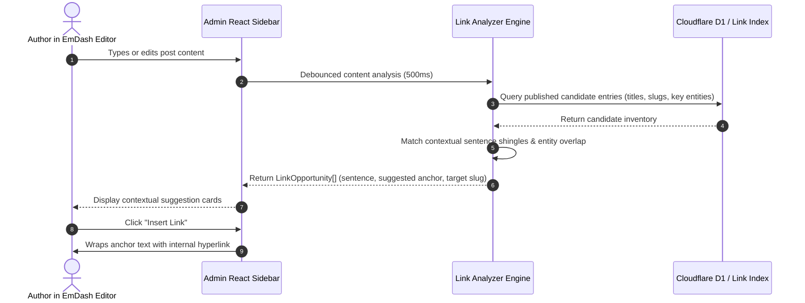

# Next-Gen Semantic SEO & Entity Intelligence Engine

> **Target:** `@emdash/plugin-seo/engine/semantic-analyzer.ts` & `@emdash/plugin-seo/engine/link-analyzer.ts`  
> **Host Runtime:** EmDash CMS & Astro on Cloudflare Workers (Free & Paid Tiers)  
> **Status:** Technical Specification & Algorithmic Blueprint  

---

## 1. The Fallacy of Keyword Density (2015 vs. Modern Search)

Legacy WordPress SEO plugins (Yoast, Rank Math, AIOSEO) still instruct writers to achieve a "keyword density of 1% to 2.5%". This heuristic was conceived in the mid-2000s when search engines relied on crude inverted term indexes.

Modern search engines (powered by Google's **RankBrain**, **BERT**, **MUM**, and **Gemini**) operate on **Entity-Attribute-Value (EAV)** knowledge graphs and dense vector embeddings. Search quality algorithms evaluate:

1. **Topical Authority & Comprehensiveness:** Does the content cover the relevant semantic entities and concepts expected for the topic?
2. **Entity Salience:** How central are the primary entities to the document structure, rather than how frequently a string is repeated?
3. **Topical Gap Elimination:** Are critical sub-entities, related procedures, safety warnings, and contextual nuances addressed?
4. **Information Gain:** Does the document offer structured answers, logical heading hierarchy, and high readability?

`@emdash/plugin-seo` eliminates raw keyword density as a primary score driver, replacing it with an **Entity Coverage Index (ECI)** and **Topical Semantic Analysis**.

---

## 2. Architectural Overview: Semantic Pipeline

```mermaid
flowchart TD
    subgraph Input Processing
        RAW[Raw Post Content / HTML] --> CLEAN[HTML Stripping & Tokenization]
        SEED[Topic / Focus Entity] --> NGRAMS[N-gram Phrase & Entity Extraction]
    end

    subgraph Free Tier: Local & Browser NLP < 2ms CPU
        CLEAN --> TFIDF[TF-IDF & BM25 Term Salience Engine]
        NGRAMS --> ENTITY_MAP[Entity & Topical Lexicon Matcher]
        TFIDF --> ECI_CALC[Entity Coverage Index Calculator]
        ENTITY_MAP --> ECI_CALC
        ECI_CALC --> GAP[Topical Gap Analysis]
        CLEAN --> READABILITY[Readability: Flesch-Kincaid & Sentence Rhythm]
    end

    subgraph Paid Tier: Progressive Workers AI Enhancement
        CLEAN --> BGE[Workers AI: @cf/baai/bge-small-en-v1.5]
        BGE --> VEC[Vectorize: Semantic Distance & Topic Centroid]
        VEC --> AI_GAPS[Semantic Topical Gap & Key Entity Inferences]
    end

    subgraph Unified Output
        GAP --> REPORT[Comprehensive Semantic Report]
        AI_GAPS --> REPORT
        READABILITY --> REPORT
        REPORT --> ADMIN[EmDash Admin Editor Sidebar]
    end
```

---

## 3. Algorithmic Models (Zero External Dependencies)

To operate within Cloudflare Workers Free Tier limits (< 10 ms CPU per request, < 1 MB bundle size), the semantic engine implements pure TypeScript algorithms using standard Web APIs.

### 3.1 N-Gram Topical Extraction & Stopword Filtering
Text is normalized and tokenized into unigrams, bigrams, and trigrams, filtering out language-specific stopwords:

```typescript
// Tokenizes clean text into filtered N-grams (1 <= n <= 3)
export function extractTopicalNgrams(text: string, maxN: number = 3): Map<string, number> {
  const words = text
    .toLowerCase()
    .replace(/[^\p{L}\p{N}\s-]/gu, ' ')
    .split(/\s+/)
    .filter((w) => w.length > 2 && !ENGLISH_STOPWORDS.has(w));

  const ngrams = new Map<string, number>();

  for (let n = 1; n <= maxN; n++) {
    for (let i = 0; i <= words.length - n; i++) {
      const phrase = words.slice(i, i + n).join(' ');
      ngrams.set(phrase, (ngrams.get(phrase) || 0) + 1);
    }
  }

  return ngrams;
}
```

### 3.2 BM25 / TF-IDF Term Salience Scoring
Rather than counting raw frequency, term salience is calculated relative to document length and standard domain distribution using the **Okapi BM25** formula:

$$\text{Score}(D, Q) = \sum_{i=1}^{N} \text{IDF}(q_i) \cdot \frac{f(q_i, D) \cdot (k_1 + 1)}{f(q_i, D) + k_1 \cdot \left(1 - b + b \cdot \frac{|D|}{\text{avgdl}}\right)}$$

* $f(q_i, D)$: Frequency of entity $q_i$ in document $D$.
* $|D|$: Document word count.
* $\text{avgdl}$: Baseline corpus average length (default: 800 words).
* $k_1 = 1.2$, $b = 0.75$: Standard saturation constants.

This ensures long-form articles are not penalized for distributing concepts, and keyword stuffing receives zero marginal benefit.

### 3.3 Entity Coverage Index (ECI) & Gap Analysis
For any primary topic or business vertical (e.g. *Carpet Cleaning Service* or *Web Development*), the engine computes coverage against an **Entity Topic Cluster**:

| Topic Cluster | Expected Supporting Entities | Minimum Threshold |
| :--- | :--- | :--- |
| **Cleaning Service** | `hot water extraction`, `steam cleaning`, `stain removal`, `drying time`, `eco-friendly`, `upholstery`, `pet odors`, `quote` | $\ge 5$ entities present |
| **Local Business** | `opening hours`, `service area`, `insured`, `guarantee`, `reviews`, `telephone`, `booking`, `pricing` | $\ge 6$ entities present |
| **Technical Article** | `architecture`, `performance`, `benchmarks`, `configuration`, `prerequisites`, `troubleshooting` | $\ge 4$ entities present |

The **Entity Coverage Index (ECI)** is scored from 0 to 100:

$$\text{ECI} = \left(\frac{\text{Entities Found}}{\text{Total Expected Entities}}\right) \times 70 + \left(\frac{\text{Heading Entity Distribution}}{\text{Total Subheadings}}\right) \times 30$$

Entities missing from the draft are presented in the EmDash Admin UI as clickable **"Entity Gap Badges"** that writers can address directly.

### 3.4 Cognitive Readability Architecture
Replaces simplistic syllable counters with the **Flesch-Kincaid Reading Ease** score adapted for edge execution:

$$\text{Reading Ease} = 206.835 - 1.015 \left(\frac{\text{total words}}{\text{total sentences}}\right) - 84.6 \left(\frac{\text{total syllables}}{\text{total words}}\right)$$

* Detects excessively long sentences ($> 28$ words).
* Validates heading hierarchy (preventing H1 $\rightarrow$ H3 skips).
* Analyzes paragraph rhythm (flags walls of text $> 120$ words without list or heading breaks).

---

## 4. Dynamic Contextual Internal Linking Engine

Legacy plugins require manual keyword anchor setup. `@emdash/plugin-seo` introduces an automated **Contextual Relevance Linker**.



### 4.1 Candidate Matcher & Anchor Context Detection
The link analyzer extracts clean sentence segments and evaluates where candidate entries naturally fit:

```typescript
export interface LinkOpportunity {
  targetId: string;
  targetTitle: string;
  targetSlug: string;
  matchedEntity: string;
  surroundingSentence: string;
  suggestedAnchor: string;
  confidenceScore: number; // 0.0 to 1.0
}

export function findContextualLinkOpportunities(
  content: string,
  currentEntryId: string,
  candidates: SuggestLinkCandidate[]
): LinkOpportunity[] {
  const opportunities: LinkOpportunity[] = [];
  const sentences = content.match(/[^.!?]+[.!?]+/g) || [];

  for (const candidate of candidates) {
    if (candidate.id === currentEntryId) continue;

    // Entities to seek within draft sentences
    const targetTerms = [candidate.title, ...(candidate.keyEntities || [])];

    for (const sentence of sentences) {
      for (const term of targetTerms) {
        const regex = new RegExp(`\\b(${escapeRegex(term)})\\b`, 'i');
        const match = sentence.match(regex);

        if (match && !sentence.includes('<a ')) {
          opportunities.push({
            targetId: candidate.id,
            targetTitle: candidate.title,
            targetSlug: candidate.slug,
            matchedEntity: term,
            surroundingSentence: sentence.trim(),
            suggestedAnchor: match[1],
            confidenceScore: term === candidate.title ? 0.95 : 0.85,
          });
          break;
        }
      }
    }
  }

  return opportunities.sort((a, b) => b.confidenceScore - a.confidenceScore);
}
```

### 4.2 Bi-directional Link Graph & Orphan Page Detection
In Cloudflare D1, the table `seo_link_graph` maintains real-time inbound and outbound links:

```sql
CREATE TABLE IF NOT EXISTS seo_link_graph (
    id TEXT PRIMARY KEY,
    source_collection TEXT NOT NULL,
    source_id TEXT NOT NULL,
    target_url TEXT NOT NULL,
    target_collection TEXT,
    target_id TEXT,
    anchor_text TEXT,
    is_external INTEGER NOT NULL DEFAULT 0,
    created_at TEXT NOT NULL DEFAULT (datetime('now'))
);
```

* **Orphan Detector:** Executes `SELECT id, title, slug FROM entries WHERE id NOT IN (SELECT DISTINCT target_id FROM seo_link_graph WHERE target_id IS NOT NULL);`
* Instant alert badge in EmDash Admin if a published page has 0 inbound links.

---

## 5. Cloudflare Workers Free vs. Paid AI Strategies

### 5.1 Free Tier Strategy: Edge & Browser NLP
* **Client-side Execution:** The bulk of real-time semantic analysis runs in the EmDash React Admin editor in the browser (via a Web Worker or debounced hook). This uses **0 ms of Cloudflare Worker CPU**.
* **Edge Validation on Save:** During `content:beforeSave`, a lightweight validation pass runs in $< 2.0\text{ ms}$ CPU, confirming critical entities before persisting.
* **Corpus Storage:** Domain topical entity clusters are stored as compact in-memory dictionaries ($< 15\text{ KB}$ minified).

### 5.2 Paid Tier Progressive Enhancement: Workers AI & Vectorize
When deployed on Cloudflare Workers Paid plans with Workers AI and Vectorize bindings enabled (`wrangler.jsonc`):

1. **Dense Vector Embeddings (`@cf/baai/bge-small-en-v1.5`):**
   * On `content:afterPublish`, entry text is passed to Cloudflare Workers AI to generate a 384-dimensional embedding vector.
   * Stored in Cloudflare Vectorize (`env.SEO_VECTOR_INDEX`).
2. **True Semantic Internal Linking:**
   * In the entry editor, the draft text embedding is queried against Vectorize to discover semantically related articles—even if they share zero exact keyword matches.
3. **Automated Topical Gap Filling with Edge LLMs:**
   * Utilizes `@cf/meta/llama-3.2-1b-instruct` or `@cf/meta/llama-3.2-3b-instruct` to generate 3 suggested FAQs and key topic expansions with zero external OpenAI/Anthropic API bills.

```typescript
// Cloudflare Workers Paid Tier AI Enhancement Bridge
export async function getWorkersAiEmbeddings(text: string, env: any): Promise<number[]> {
  if (!env?.AI) return [];
  const response = await env.AI.run('@cf/baai/bge-small-en-v1.5', { text: [text] });
  return response.data[0];
}
```

---

## 6. TypeScript Interface Definitions

```typescript
export interface SemanticEntity {
  name: string;
  category: 'primary' | 'secondary' | 'contextual';
  salienceScore: number; // 0.0 - 1.0
  occurrences: number;
  inHeadings: boolean;
  inFirstParagraph: boolean;
}

export interface EntityGap {
  entity: string;
  recommendedCategory: string;
  importance: 'critical' | 'recommended' | 'optional';
  exampleSnippet: string;
}

export interface SemanticAnalysisReport {
  entityCoverageIndex: number; // 0 - 100
  grade: 'Excellent' | 'Good' | 'Needs Expansion';
  entitiesDetected: SemanticEntity[];
  entityGaps: EntityGap[];
  topicalNgrams: Array<{ phrase: string; count: number }>;
  readability: {
    fleschReadingEase: number;
    sentenceCount: number;
    avgWordsPerSentence: number;
    hardSentencesCount: number;
  };
  linkOpportunities: LinkOpportunity[];
}
```
